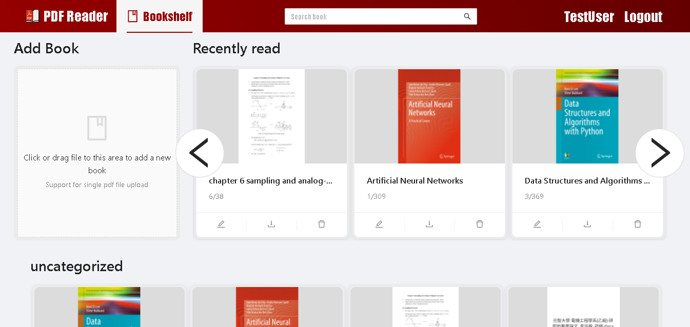
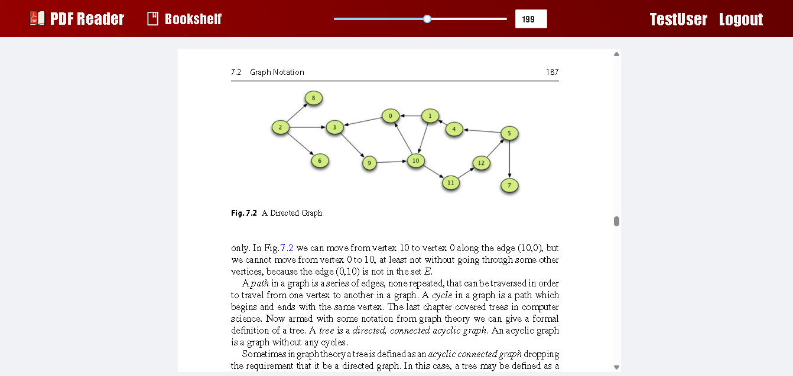

# 線上 PDF 閱讀器
[](https://github.com/spring-projects/spring-boot)
[](https://github.com/angular/angular)




此專案是一個基於網頁的應用程式，用於管理和閱讀 PDF 文件。它提供了使用者驗證、書架管理、PDF 檢視等功能。前端使用Angular開發，後端使用Spring Boot。

## 功能

### 使用者功能
- **書架管理**：使用者可以上傳、編輯和刪除個人書架中的書籍。
- **PDF 閱讀器**：使用者可以直接在瀏覽器中檢視 PDF 文件，並記錄閱讀的進度。
- **搜尋與篩選**：使用者可以依書名搜尋書籍，並依類別篩選。
- **最近閱讀**：顯示最近存取的書籍，方便快速訪問。

<!-- ### 管理員功能
- **使用者管理**：管理員可以檢視、更新角色以及刪除使用者。
- **書籍可見性控制**：管理員可以管理書籍的可見性（私人、透過連結或公開）。 -->

## 前端
前端使用Angular搭配Ng-Zorro UI進行開發。

### 開發
啟動前端開發伺服器：
```bash
npm run start
```
在瀏覽器中打開 `http://localhost:4200/`。

### 建置
將前端建置為生產環境：
```bash
npm run build
```
建置的檔案將存放於 `dist/` 資料夾中。

## 後端
後端使用Spring Boot開發，提供用於管理使用者、書籍和書籤的API。

## API Endpoints

### 驗證
- `POST /api/auth/login`：登入使用者。
- `POST /api/auth/register`：註冊新使用者。
- `POST /api/auth/logout`：登出當前使用者。

### 書架
- `GET /api/bookshelf/books`：檢索使用者的所有書籍。
- `POST /api/bookshelf/book`：上傳新書籍。
- `PUT /api/bookshelf/book/name/{id}`：更新書籍名稱。
- `PUT /api/bookshelf/book/category/{id}`：更新書籍類別。
- `DELETE /api/bookshelf/book/{id}`：刪除書籍。

### 閱讀器
- `GET /api/reader/bookmark/{id}`：檢索書籍的書籤。
- `PUT /api/reader/bookmark/{id}`：更新書籍的書籤。
- `GET /api/reader/content/{id}`：檢索書籍內容。

### 儀表板（管理員控制）
- `GET /api/dashboard/users`：檢索所有使用者。
- `PUT /api/dashboard/user/role/{id}`：更新使用者角色。
- `DELETE /api/dashboard/user/{id}`：刪除使用者。

## 部屬

1. 下載docker image：
   ```bash
   docker pull a2823kevin/online-pdf-reader:latest
   ```

2. 配置後端環境變數：
   - 下載 `backend/.env.example` 為 `.env`，並根據需求設定相關參數。

3. 使用Docker運行：
   ```bash
   docker run --env-file .env -p 80:80 a2823kevin/online-pdf-reader
   ```